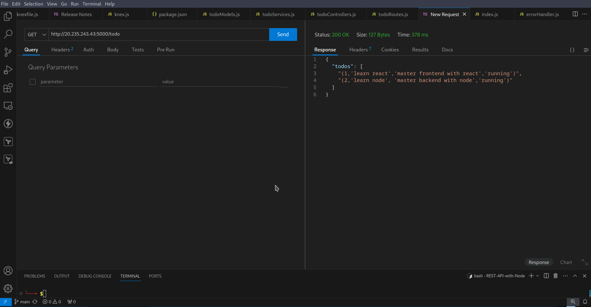
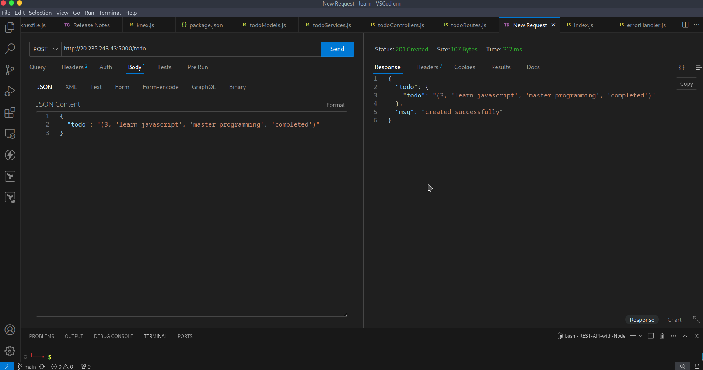

# REST-API-with-Node

In this project, we will create a REST API to perform CRUD operations using Node framework, `express`. The API will perform actions like creating, updating, deleting and reading different todos available in the database.

- For query building, knex is used.
- This node app has endpoints:
    - GET `/todos` - to get all the todos.
    - GET `/todos/:id` - to get a single todo.
    - POST `/todos` - to add a new todo.
    - PUT `/todos/:id` - to update a todo.
    - DELETE `/todos/:id` - to delete a todo.
 
> I have used knex for query building and execution with postgres as the database.  

## Directory Structure
`REST-API-with-Node`
 * [LICENSE](./LICENSE)
 * [db](./db)
   * [knexfile.js](./db/knexfile.js)
   * [knex.js](./db/knex.js)
 * [models](./models)
   * [todoModels.js](./models/todoModels.js)
 * [services](./services)
   * [todoService.js](./services/todoService.js)
 * [controllers](./controllers)
   * [todoControllers.js](./controllers/todoControllers.js)
 * [nodemon.json](./nodemon.json)
 * [package-lock.json](./package-lock.json)
 * [package.json](./package.json)
 * [routes](./routes)
   * [todoRoutes.js](./routes/todoRoutes.js)
   * [index.js](./routes/index.js)
 * [index.js](./index.js)
 * [middlewares](./middlewares)
   * [notFound.js](./middlewares/notFound.js)
   * [errorHandler.js](./middlewares/errorHandler.js)
 * [README.md](./README.md)

- routes consist of different end points for request
- controllers are responsible for handling the request-response cycle
- services are reponsible for handling the business logic
- models deal with data in the database
- middlewares for handling errors if the routes or URLs donot match 

- The flow of the request is as below.  
    - A client requests the server for a resource.
    - The routes in the server are matched with the request.  
    - The controller is called with the request and response objects, It calls the service.   
    - The service calls the model to perform the database operations.
    - The model performs the database operations and returns the result to the service then the flow is reversed till the response is sent to the client. 

The request-response cycle follows below order.

`index.js` => `routes` => `controllers` => `services` => `models`

### Testing the API with `thunderclient`

1. Making `GET` request at `<ipaddress>:<port>/todo` endpoint.

2. Making `POST` request at `<ipaddress>:<port>/todo` endpoint.

